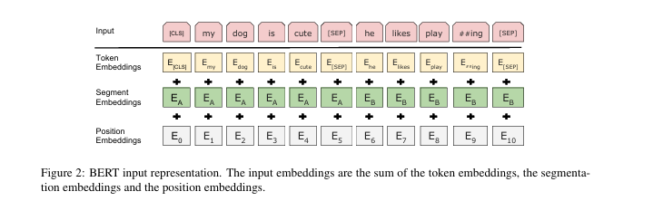

# BERTレポート: [BERT]

## 概要
本ドキュメントは、BERTの論文(BERT: Pre-training of Deep Bidirectional Transformers for Language Understanding)の論文のまとめと、実装をしたもの
---

## 1. データファイル:
データに関しては、記事同様に京都大学黒橋・河原研究室様の「英語中国語基本文データ」を使用させていただきました。
参考:

https://nlp.ist.i.kyoto-u.ac.jp/?%E6%97%A5%E8%8B%B1%E4%B8%AD%E5%9F%BA%E6%9C%AC%E6%96%87%E3%83%87%E3%83%BC%E3%82%BF

---

## 2. 論文第1章：Introduction（はじめに）

自然言語処理（NLP）において、言語モデルの事前学習は様々なタスクの精度向上に極めて有効である。しかし、従来の事前学習アプローチには構造的な限界が存在していた。本章では、その課題を指摘し、解決策としてのBERTを提案している。

### 従来モデルの重大な制限
当時の主流モデル（OpenAI GPTなど）は、**一方向（Left-to-Right）のアーキテクチャ**を採用していた。これは過去の単語から未来の単語を予測する生成モデルの制約であり、質問応答（QA）のように「文章全体の前後関係（双方向の文脈）」を深く理解する必要があるタスクにおいては、大きなパフォーマンスのボトルネックとなっていた。

### BERTの提案と解決策
この一方向性の制約を打破するため、**BERT（Bidirectional Encoder Representations from Transformers）** を提案した。
* **Masked Language Model (MLM)**: 入力トークンの一部をランダムに隠し、周囲の左右両方の文脈から予測させる「穴埋め問題」を導入。これにより、深い双方向の表現学習（Deep Bidirectional Representations）を可能にした。
* **Next Sentence Prediction (NSP)**: 文と文の論理的な繋がりを理解させるための事前学習タスクを追加した。

### 主な貢献
1. **完全な双方向性の証明**: 一方向モデルや、独立したモデルの浅い結合（ELMo）に比べ、MLMを用いた双方向の事前学習が極めて重要であることを実証した。
2. **専用アーキテクチャからの脱却**: タスクごとに複雑な専用ネットワークを設計する必要性をなくし、出力層を1つ追加して微調整（ファインチューニング）するだけで多様なタスクに対応できる汎用的なフレームワークを確立した。
3. **圧倒的なパフォーマンス**: 11の主要なNLPタスクで当時の世界記録（SOTA）を大幅に更新した。

---

## 3. 論文第2章：Related Work（関連研究）

事前学習による言語表現の獲得には長い歴史があり、主に「特徴量ベース」と「ファインチューニングベース」の2つのアプローチに大別される。BERTはこれら先行研究の課題を克服し、CV（画像認識）分野における転移学習の成功をNLP分野へ適用したモデルである。

### 先行研究との比較

| アプローチ | 代表的なモデル | 特徴とBERTから見た限界 |
| :--- | :--- | :--- |
| **特徴量ベース**<br>*(Feature-based)* | **ELMo** | 事前学習した単語表現を、タスク専用のモデルに「追加の特徴量」として組み込む手法。<br>⚠️ **限界**: 左から右、右から左のモデルを独立して学習し、最後に浅く結合（ガッチャンコ）しているだけであり、内部で文脈が深く混ざり合う真の双方向ではない。 |
| **微調整ベース**<br>*(Fine-tuning)* | **OpenAI GPT** | 事前学習済みのモデルに簡単な出力層を足し、タスクごとにモデル全体の全パラメータを更新する手法。<br>⚠️ **限界**: アーキテクチャが「左から右」の一方向モデルに限定されているため、文脈を捉える力が弱い。 |

### BERTの立ち位置（ImageNet革命のNLP版）
コンピュータビジョン（画像認識）の世界では、巨大なデータセット（ImageNet）で事前学習したモデル全体を、別の画像分類タスクでファインチューニングする「転移学習」がすでに常識となっていた。
BERTは、ELMoの「双方向性」と、GPTの「ファインチューニングの利便性」の長所を統合し、さらに**「真の双方向アーキテクチャ」**へと進化させることで、画像認識分野で起きたパラダイムシフトを自然言語処理の領域で実現したものである。

---

## 4. 論文第3章：BERT（モデル構造と学習手法）

本章では、BERTのモデルアーキテクチャ、データの入力表現、および「事前学習（Pre-training）」と「微調整（Fine-tuning）」の2段階のフレームワークについて詳細に定義している。

### 4.1 モデルアーキテクチャ (Model Architecture)

BERTの本体は、Vaswani et al. (2017) で提案されたオリジナルのTransformerから「エンコーダ部分」のみを抽出して多層に積み重ねた **多層双方向Transformerエンコーダ（Multi-layer bidirectional Transformer encoder）** である。
ネットワークの規模を決定するハイパーパラメータを以下のように定義する。

* $L$: Transformerブロック（層）の数
* $H$: 隠れ層の次元数（Hidden size）
* $A$: Multi-Head Attentionのヘッド数

論文では2つのモデルサイズが提供されている。
* **BERT-Base**: $L=12, H=768, A=12$ （総パラメータ数: 1.1億）
* **BERT-Large**: $L=24, H=1024, A=16$ （総パラメータ数: 3.4億）

各層におけるFeed-Forwardネットワークの隠れ層の次元数は $4H$（Baseなら $3072$）に設定されている。

### 4.2 入力表現 (Input/Output Representations)

多様なNLPタスクに対応するため、1つのシーケンス（最大長 $N=512$）の中に、1つの文または2つの文のペアを格納できる柔軟な入力表現を設計した。

シーケンスの先頭には常に分類用の特殊トークン `[CLS]` が挿入され、2つの文を連結する場合は区切りトークン `[SEP]` を使用する。
各トークン $i$ に対する最終的な入力ベクトル $E_i \in \mathbb{R}^H$ は、以下の3つのベクトルの要素ごとの和（Sum）として構築される。

$$
E_i = E_{token}(x_i) + E_{segment}(x_i) + E_{position}(x_i)
$$

1. **Token Embeddings** ($E_{token}$): WordPiece（語彙数約30,000）によって分割された単語トークンの表現。
2. **Segment Embeddings** ($E_{segment}$): トークンが文A（Segment 0）と文B（Segment 1）のどちらに属するかを示す表現。
3. **Position Embeddings** ($E_{position}$): 最大512トークンまでの位置情報を示す表現（BERTでは固定の三角関数ではなく、学習可能なパラメータとして扱う）。



### 4.3 事前学習 (Pre-training BERT)

BERTは、従来の言語モデル（左から右への次単語予測）を使用せず、2つの教師なし学習タスクを同時に最適化することで強力な双方向表現を獲得する。12層を通過したあとの `[CLS]` の最終隠れ状態を $C \in \mathbb{R}^H$、各単語の最終隠れ状態を $T_i \in \mathbb{R}^H$ とする。

#### タスク1：Masked LM (MLM)
入力トークンの15%をランダムに選択し、その単語を文脈から予測する。選ばれたトークンに対して以下の確率で意図的なノイズを加える（80-10-10の法則）。
* 80%：`[MASK]` トークンに置換
* 10%：ランダムな別の単語に置換
* 10%：元の単語のまま維持（ファインチューニング時との差異を軽減するため）

損失関数は、マスクされた位置 $i$ の出力ベクトル $T_i$ に対する交差エントロピー誤差（Cross Entropy Loss）を計算する。重み行列 $W_{vocab} \in \mathbb{R}^{V \times H}$（$V$ は語彙数）を用いて確率分布を出力する。

$$
P(y_i | X) = \text{softmax}(W_{vocab} \cdot T_i + b_{vocab})
$$

#### タスク2：Next Sentence Prediction (NSP)
文と文の関係性を学習するため、Segment AとSegment Bのペアを入力し、BがAの「本当に続く文（IsNext）」か「無関係な文（NotNext）」かを2値分類する。
抽出された `[CLS]` ベクトル $C$ を用いて確率を計算する。重み行列 $W_{NSP} \in \mathbb{R}^{2 \times H}$ とする。

$$
P(\text{IsNext}) = \text{softmax}(W_{NSP} \cdot C + b_{NSP})
$$

モデル全体の事前学習における最終的な損失 $L_{total}$ は、これら2つのタスクの損失の和として定義され、同時に逆伝播（Backpropagation）される。

$$
L_{total} = L_{MLM} + L_{NSP}
$$

### 4.4 微調整 (Fine-tuning BERT)

ファインチューニングのフェーズでは、事前学習済みの重みを初期値とし、解きたいタスクに合わせて入出力を切り替え、モデル全体の全パラメータをEnd-to-Endで再学習（微調整）する。

* **文章分類タスク（NLI, 感情分析など）**:
  出力される `[CLS]` ベクトル $C$ に分類層 $W_{task} \in \mathbb{R}^{K \times H}$（$K$ はクラス数）を追加し、予測を行う。
  $$P = \text{softmax}(W_{task} \cdot C)$$
* **トークンレベルのタスク（QA, 固有表現抽出など）**:
  各単語のベクトル $T_i$ を用いる。例えばSQuAD（QAタスク）では、解答範囲の開始（Start）と終了（End）のベクトル $S, E \in \mathbb{R}^H$ を新たに学習し、各 $T_i$ との内積（$S \cdot T_i$, $E \cdot T_i$）によって正解スパンを抽出する。

自己注意機構（Self-Attention）の特性により、これらの変更は極めて容易であり、GPU1枚の環境でも数時間程度で高品質なファインチューニングが完了する。

---

## 5. 論文第4章：Experiments（実験結果）

本章では、11の多様な自然言語処理タスクにおいて、BERTが既存のSOTA（State-of-the-Art：最高精度）をどのように塗り替えたかを示している。単一の事前学習済みアーキテクチャから、出力層をわずかに変更するだけであらゆるタスクに対応できる汎用性の高さが証明された。

### 4.1 GLUEベンチマーク（文章全体の分類タスク）
多様な9つの自然言語理解タスク（感情分析、含意関係認識、文の類似度判定など）の評価セット。
* **手法**: `[CLS]` トークンの最終隠れ状態 $C$ を分類層となる全結合ネットワークに入力し、モデルの全パラメータをEnd-to-Endでファインチューニングした。
* **結果**: 従来の最高精度（OpenAI GPT）の72.8%から **80.5%** へと劇的なスコア向上を達成し、言語理解のベンチマークにおいて圧倒的な差をつけた。

### 4.2 SQuAD v1.1 / v2.0（質問応答：QAタスク）
質問文と長文パラグラフが与えられ、パラグラフ中から答えとなるテキストの範囲（スパン）を抽出するタスク。v2.0では「答えが存在しない」ケースも含まれる。
* **手法**: 質問文をSegment A、パラグラフをSegment Bとして入力。新たに「開始ベクトル $S$」と「終了ベクトル $E$」を学習させ、長文側の各単語の出力ベクトル $T_i$ との内積をとることで、正解スパンの始点と終点を予測した。
* **結果**: トップのアンサンブルモデル（複雑なQA専用ネットワーク）を単体モデルで上回り、F1スコアで人間のパフォーマンス（Human performance）をも凌駕する歴史的快挙を達成した。

### 4.3 SWAG（多肢選択問題）
与えられた文の後に続く最も適切な文を4つの選択肢から選ぶ常識推論タスク。
* **手法**: 「元の文 ＋ 選択肢」のペアを4パターン作成し、それぞれの入力から得られた4つの `[CLS]` ベクトルのスコアをSoftmax関数で比較した。
* **結果**: 人間の正答率（80.0%）を大幅に超える **86.3%** を記録した。

---

## 6. 論文第5章：Ablation Studies（アブレーション研究）＆ 第6章：Conclusion（結論）

### 5.1 事前学習タスクの影響（アーキテクチャの比較）
BERTのコアとなる2つの事前学習タスク（MLMとNSP）の有効性を、一部の機能を意図的に削ったモデル（Ablated models）を作成して比較検証した。

* **No NSP**: NSP（次の文予測）を省き、MLM（穴埋め）のみで学習したモデル。NLI（自然言語推論）やQAタスクで精度が有意に低下し、文間の関係性を学ぶNSPの重要性が示された。
* **LTR & No NSP**: MLMの代わりにLeft-to-Right（一方向）の言語モデルを用いたGPTスタイルのモデル。右側の文脈（未来の情報）を参照できないため、QAタスク（SQuAD）などで**スコアが壊滅的に悪化**した。これにより、MLMによる「真の双方向性」がBERTの圧倒的パフォーマンスの最大の要因であることが完全に証明された。

### 5.2 モデルサイズの影響
層の数（$L$）、隠れ層の次元（$H$）、Attentionヘッド数（$A$）を変更し、モデル規模と精度の関係を調査した。
* **結果**: モデルのパラメータ数を巨大にするほど、小規模なデータセットに対するファインチューニングであっても、過学習を起こすことなく一貫して汎化性能が向上することが確認された。

### 5.3 特徴量ベース（Feature-based）のアプローチ
ファインチューニング（全パラメータ更新）を行わず、BERTの重みを固定して「文脈を考慮した単語ベクトル抽出器（ELMoのような使い方）」として利用した場合の検証。
* **結果**: NER（固有表現抽出）タスクにおいて、Transformerの「最後の4層の出力を結合したベクトル」を入力特徴量として用いた場合、全パラメータを更新する手法に肉薄する高いスコア（F1: 92.1）を達成した。計算資源が限られる実務環境においても、BERTが強力な特徴量抽出器として有用であることが示された。

### 論文の結論（第6章：Conclusion）
豊富な教師なしデータによる「言語モデルの事前学習」が、多くの自然言語理解システムの不可欠な基盤となっていることを示した。特に、従来の一方向モデルの限界を打破した**深く双方向なアーキテクチャ（Deep Bidirectional Architecture）**を一般化し、同一のモデル構造で幅広いタスクの限界を突破したことが、本研究の最大の貢献である。

---

## 7 実装

本タスクではライブドアニュースコーパスをデータセットとして使用した。事前のデータ探索（EDA）により、各カテゴリ間のデータ不均衡はさほど見られないことを確認している。

### 7.1 モデルの制約と学習時の課題
今回の実装においては、以下の要因から精度の向上に限界が見られる厳しいモデル構成となった。

* **タイトルの除外**: 記事の中で最も重要な情報が要約されている「タイトル」を入力に含めず、本文のみを使用した。
* **系列長の制限**: 本文には512トークンを超える長文のデータが多く含まれており、モデルの入力制限（`max_length=512`）によって記事後半の重要な文脈が切り捨てられてしまっている。

### 7.2 学習の推移と過学習（Overfitting）
学習ループを回した結果、事前学習済みモデルの表現力が高いため早期に収束するものの、**Epoch 3以降で過学習（Overfitting）**に陥る傾向が確認された。

以下は、8エポックでフル・ファインチューニングを実行した際のログである。Epoch 2の時点で Validation Accuracy が 81.82% に達しているが、最終的な Epoch 8 になると、訓練データへの適合（暗記）が進みすぎる結果（Train Loss: 0.0470）、検証データの精度が 75.85% まで低下し、Val Loss も悪化していることが明確に読み取れる。

```text
Epoch 2/8
------------------------------
Training: 100%|██████████| 369/369 [01:34<00:00,  3.91it/s, loss=0.0154]
Average Train Loss: 0.1431
Validation: 100%|██████████| 47/47 [00:04<00:00, 11.41it/s]
Average Val Loss: 0.7729
Validation Accuracy: 81.82%

Epoch 8/8
------------------------------
Training: 100%|██████████| 369/369 [01:35<00:00,  3.85it/s, loss=0.0171]
Average Train Loss: 0.0470
Validation: 100%|██████████| 47/47 [00:04<00:00, 10.84it/s]
Average Val Loss: 0.9287
Validation Accuracy: 75.85%