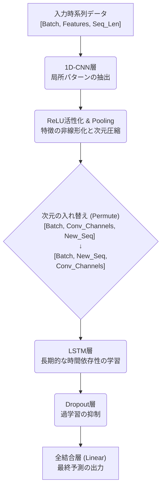

# 機械学習における正規化の確認

## 概要
本ドキュメントは、Jena Climate DatasetのT（degC）をCNN+LSTMで予測したものです
---
## 1.データファイル

Jena Climate Datasetは、ドイツのイエナ（Jena）で記録された気象データです。

* **観測期間**: 2009年1月1日 〜 2016年12月31日（約8年間）
* **サンプリング頻度**: 10分間隔
* **総データ数 (行数)**: **約 420,551 行**
* **変数の数**: 14種類（日時データ `Date Time` を除く）
---

## 2. 特徴量エンジニアリング

精度のさらなる向上と計算コストの最適化のため、以下の前処理を実装します。

### 2.1 特徴量の精査
計算コスト削減と過学習防止のため、相関が極めて高い、または冗長な以下の変数を削除します。
* **削除対象**: `Tpot (K)`, `Tdew (degC)`, `VPmax (mbar)`, `VPact (mbar)`, `VPdef (mbar)`, `sh (g/kg)`, `H2OC (mmol/mol)`, `max. wv (m/s)`

### 2.2 周期性・方向のエンコーディング
機械学習モデルが時間や方向の「連続性」を理解できるよう変換します。
* **時間情報**: 日付・時刻を `sin` / `cos` 変換し、円環構造を保持。
* **風向 (wd)**: 
    1. ラジアン（Radian）表記に変換。
    2. 風速と組み合わせてベクトル分解（水平・垂直成分）を行い、数値として学習可能な形式へ変換。

---

## 3. CNN+LSTMに関して

時系列データの予測において、単一のネットワーク構造だけでなく、複数のアーキテクチャを組み合わせることで高い予測精度を実現するアプローチが広く採用されています。本節では、1次元畳み込みニューラルネットワーク（1D-CNN）と長短期記憶ネットワーク（LSTM）を統合した「CNN-LSTMアーキテクチャ」のメカニズムについて解説します。

### 3.1 アーキテクチャの基本思想

CNN-LSTMモデルは、それぞれのネットワークが持つ強みを分業させることで機能します。

1. **CNN（局所的特徴の抽出）:** 気温の急激なスパイクや、数日間の短期的な周期性などの「局所的な波形パターン」を抽出し、ノイズを平滑化（または特徴を強調）します。
2. **LSTM（長期依存性の学習）:** CNNが抽出・圧縮した特徴マップを入力として受け取り、「過去から現在、そして未来へと続く長期的なトレンドや文脈」を学習します。

### 3.2 ネットワークの全体像

モデルのデータフローは以下の図のように進行します。入力データはまずCNNブロックを通過し、その後次元変換を経てLSTMブロックへと渡されます。

### 3.3 1D-CNNによる特徴抽出の数学的背景

入力される多変量時系列データを $X \in \mathbb{R}^{C_{in} \times L}$（$C_{in}$は特徴量数、$L$はシーケンス長）とします。
1D-CNNの各フィルタは、カーネルサイズ $K$ の重み行列 $W \in \mathbb{R}^{C_{out} \times C_{in} \times K}$ とバイアス $b \in \mathbb{R}^{C_{out}}$ を用いて、時間軸に沿ってスライドしながら畳み込み演算を行います。

出力となる特徴マップのステップ $t$ における値 $y[t]$ は以下のように計算されます。

$$y[t] = \sigma \left( \sum_{c=1}^{C_{in}} \sum_{k=0}^{K-1} W_{c,k} \cdot X_{c, t+k} + b \right)$$

ここで $\sigma$ は非線形活性化関数（通常は ReLU: $f(x) = \max(0, x)$）です。この演算により、生のセンサーデータから予測に有用な波形の特徴表現が高次元空間にマッピングされます。

### 3.4 LSTMによる時間依存性のモデリング

CNNによって抽出された特徴マップのシーケンスを $H = (h_1, h_2, \dots, h_T)$ とします。LSTMは、内部に保持する「セル状態（Cell State）」と3つのゲート（忘却、入力、出力）を用いて、情報の取捨選択を行います。

各タイムステップ $t$ において、LSTMは以下の計算を行い、隠れ状態 $h_t$ とセル状態 $c_t$ を更新します。

1. **忘却ゲート（Forget Gate）:** 過去の情報をどれだけ保持するかを決定します。
   $$f_t = \sigma_g(W_f x_t + U_f h_{t-1} + b_f)$$

2. **入力ゲート（Input Gate）と候補セル状態:** 新しい情報をセル状態にどれだけ追加するかを決定します。
   $$i_t = \sigma_g(W_i x_t + U_i h_{t-1} + b_i)$$
   $$\tilde{c}_t = \tanh(W_c x_t + U_c h_{t-1} + b_c)$$

3. **セル状態の更新（Cell State Update）:** 過去の記憶と新しい記憶を合成します。
   $$c_t = f_t \odot c_{t-1} + i_t \odot \tilde{c}_t$$

4. **出力ゲート（Output Gate）:** 次の層（または全結合層）へ渡す隠れ状態を決定します。
   $$o_t = \sigma_g(W_o x_t + U_o h_{t-1} + b_o)$$
   $$h_t = o_t \odot \tanh(c_t)$$

（※ $\odot$ は要素ごとの積、アダマール積を表します）

### 3.5 統合におけるテンソル形状（次元）の変換戦略

この2つのモデルを直列に繋ぐ際、最も重要になるのが**テンソルの次元（Shape）の管理**です。PyTorch等のフレームワークにおいて、CNNとLSTMはそれぞれ期待する入力の次元順序が異なります。

* **CNNの期待する入力:** `[バッチサイズ, チャネル数(特徴量), シーケンス長]`
* **LSTMの期待する入力:** `[バッチサイズ, シーケンス長, チャネル数]`（`batch_first=True`の場合）

モデル内部では、データが以下のように変形（Permute）しながら伝播します。

1. **入力データの準備:** 元データ `[B, 14, 8]` をCNN用に `[B, 8, 14]` に変換。
2. **CNNの通過:** 特徴抽出とプーリングにより、時間軸が圧縮されチャネル数が増加。例として `[B, 32, 7]` となる。
3. **LSTMへの引き渡し:** 再び次元を入れ替え、`[B, 7, 32]` としてLSTMへ入力。これにより、LSTMは「7ステップの長さを持つ、32次元の特徴時系列」としてCNNが抽出した特徴空間上で時間的モデリングを行うことが可能になります。

---

## 3. CNN+LSTMモデルの結果

### 3.1 実験結果

結論として、今回のCNN-LSTMモデルの導入は予測精度の向上には繋がらなかった。(0.067~0.07程度)

初期モデルにおいて予測値が平均値付近で平坦化する現象（アンダーフィット）が見られたため、モデルの内部構造や設定の調整（損失関数を `HuberLoss` から `MSELoss` への変更、Dropoutの調整、最大プーリングへの変更など）を裏で幾度も試みた。しかし、いずれの試行においても、ターゲットデータの特徴的な波形や急激な変化（ピーク）を捉えることはできなかったです。

ただ、lstm単体よりかは、予測の線がギザギザに近くなっているので、CNNのいいところを取り入れることは少しできたと感じています。

### 3.2 原因の考察

モデルの調整を行っても精度が改善しなかったことから、問題の本質はモデルのアーキテクチャ自体ではなく、**「データ量」**と**「タスクの難易度」のバランス**にあると考えられます。具体的には以下の2点がボトルネックとなった可能性が高いです。

1. **データ数の不足:**
   日次データへとダウンサンプリングしたことで、データ数が約2,900行（学習データは約2,000件）まで激減した。この規模のデータ量は、表現力の高いCNNやLSTMといった深層学習モデルが十分な汎化性能を獲得するには少なすぎたと考察できます。
2. **2週間先予測の難易度の高さ:**
   気象現象などの複雑な時系列データにおいて、わずか14日間の過去データから「2週間先（14日間）」をピンポイントで予測するタスクは非常に難易度が高いと思った。モデルにとっては、無理に予測して大外しするよりも、安全策として標準化された平均値（0付近）を出力し続ける方が損失（Loss）を抑えられるため、学習のサボり（平均値予測）が発生しました。

### 3.3 今後の展望

今回の検証により、小規模な日次データに対する深層学習モデルの適用限界が明確になりました。もし改善するなら

* **大規模データでの検証:** 日次ではなく、1時間単位（Hourly）などでサンプリングされた、数万〜数十万行規模の大規模データセットを用意します。
* **適切なタスク設計:** 潤沢なデータ量を用いてモデルのポテンシャルを最大限に引き出した環境下で、改めてCNN-LSTMによる波形の追従性と長期予測の有効性を検証します。

参考サイト・論文

Pythonによる時系列予測 (Compass Data Science),Marco Peixeiro (著), 株式会社クイープ (翻訳)
長短期記憶型ニューラルネットワーク：LSTMによる時系列予測,荒  木  勝  啓
https://qiita.com/sugiyama404/items/49420557981b399acdf8
https://sanshonoki.hatenablog.com/entry/2024/12/16/222245

なお、文章に関しては、適宜生成AIを利用しています。