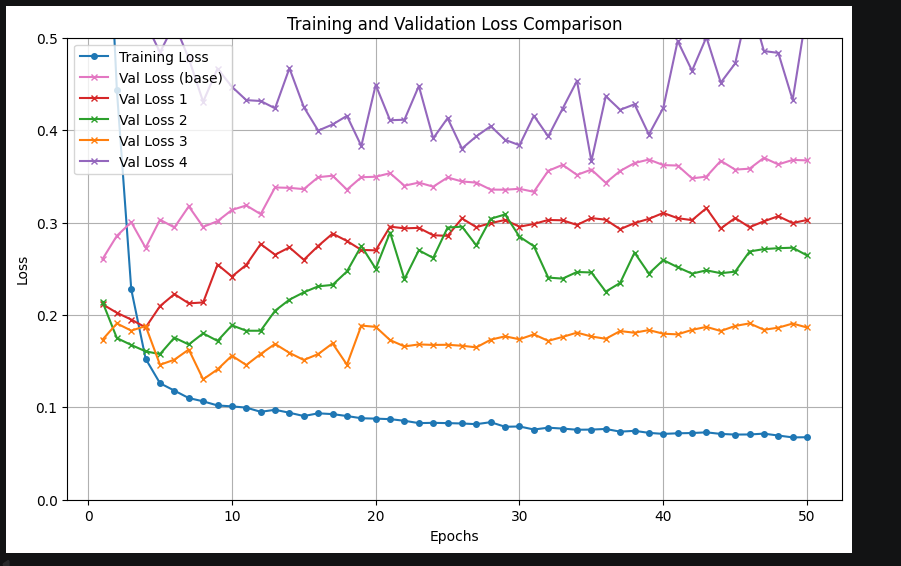

# 機械学習における正規化の確認

## 概要
本ドキュメントは、Jena Climate DatasetのT（degC）をCNNで予測し、各モデルにそれぞれ異なる正規化を用いて、その精度と汎化性能を確認したものです。
---
## 1.データファイル

Jena Climate Datasetは、ドイツのイエナ（Jena）で記録された気象データです。

* **観測期間**: 2009年1月1日 〜 2016年12月31日（約8年間）
* **サンプリング頻度**: 10分間隔
* **総データ数 (行数)**: **約 420,551 行**
* **変数の数**: 14種類（日時データ `Date Time` を除く）
---

## 2. 特徴量エンジニアリング

精度のさらなる向上と計算コストの最適化のため、以下の前処理を実装します。

### 2.1 特徴量の精査
計算コスト削減と過学習防止のため、相関が極めて高い、または冗長な以下の変数を削除します。
* **削除対象**: `Tpot (K)`, `Tdew (degC)`, `VPmax (mbar)`, `VPact (mbar)`, `VPdef (mbar)`, `sh (g/kg)`, `H2OC (mmol/mol)`, `max. wv (m/s)`

### 2.2 周期性・方向のエンコーディング
機械学習モデルが時間や方向の「連続性」を理解できるよう変換します。
* **時間情報**: 日付・時刻を `sin` / `cos` 変換し、円環構造を保持。
* **風向 (wd)**: 
    1. ラジアン（Radian）表記に変換。
    2. 風速と組み合わせてベクトル分解（水平・垂直成分）を行い、数値として学習可能な形式へ変換。

---

## 3. 各種深層学習モデルの概要

本解析では、時系列データに対して、CNNをつくり、それぞれのモデルにおいて、異なる正規化を用いました。
### モデル実験条件一覧

- **model(base)**: 何もなし（ベースラインモデル）
- **model1**: L2正則化（Weight Decay）
- **model2**: Dropout（ドロップアウト）
- **model3**: Dropout + StepLR（学習率スケジューラ）
- **model4**: バッチ正規化メイン + 一部Dropout（CNNブロック内はBN、全結合層前のみDropout）

---
## 4. それぞれの正規化とそのメカニズム

---

### 📋 model (base) : 何もなし（ベースライン）
正則化を一切行わない、純粋なニューラルネットワークです。モデルは与えられた誤差関数（Huber Loss） $L_{data}$ を最小化することだけに専念します。データに対するモデル本来の「素の表現力」と「過学習のしやすさ」を測定するための基準点となります。

---

### 📋 model1 : L2正則化（Weight Decay）
**【目的】重みが大きくなりすぎる（特定のデータに過剰適合する）のを防ぐ**

Adamオプティマイザの `weight_decay` 引数として実装しました。本来の誤差（Loss）に、ネットワークの全重みパラメータ $w$ の二乗和をペナルティ項（一般にL2ノルムと呼ばれる）として足し合わせます。

$$L_{total} = L_{data} + \frac{\lambda}{2} \sum_{i} w_i^2$$

* $L_{data}$ : 本来のLoss（Huber Loss）
* $\lambda$ : ペナルティの強さ（制御係数。例：`1e-4`）
* $w_i$ : ネットワーク内の各重み

**【メカニズム】**
この数式により、勾配更新のたびに重み自体を一定割合小さくする（減衰させる）力が働きます。結果として、モデルが極端な数値を学習してデータを「丸暗記」することが防がれ、滑らかで汎化性能の高い決定境界が作られます。

---

### 📋 model2 : Dropout（ドロップアウト）
**【目的】ニューロン同士の共適応（特定の特徴量への強い依存関係）を断ち切る**

全結合層の手前に `nn.Dropout(p)` として配置しました。学習時の各ステップ（ミニバッチ処理）において、確率 $p$ でランダムにニューロンの出力を $0$ にリセット（マスク）します。

$$y_i = \begin{cases} 0 & (\text{確率 } p) \\ \frac{x_i}{1-p} & (\text{確率 } 1-p) \end{cases}$$

* $x_i$ : 選択されたニューロンへの入力値
* $p$ : ドロップアウト率（例：`0.3`）
* $\frac{1}{1-p}$ : **Inverted Dropout（逆ドロップアウト）** と呼ばれるスケール調整

**【メカニズム】**
PyTorchなどで採用されている Inverted Dropout では、学習時に一部のニューロンが休んだ分、生き残ったニューロンの出力をあらかじめ $\frac{1}{1-p}$ 倍に底上げします。これにより、テスト本番時（全員参加・`model.eval()`）にわざわざ重みを掛け算し直す手間を省き、学習時とテスト時で出力の期待値を完全に一致させることができます。

---

### 📋 model3 : Dropout + StepLR（学習率スケジューラ）
**【目的】学習終盤のLossのブレを抑え、局所最適解の奥底へ着地させる**

構造的な正則化（Dropout）に加え、最適化の歩幅（学習率 $\eta$）をエポックの進行度に応じて動的に縮小させる `StepLR` を導入しました。指定したエポック数（$step\_size$）を通過するごとに、現在の学習率に減衰率（$\gamma$）を掛け算します。

$$\eta_{epoch} = \eta_{initial} \times \gamma^{\lfloor \frac{epoch}{step\_size} \rfloor}$$

* $\eta_{initial}$ : 初期の学習率（例：`0.001`）
* $\gamma$ : 減衰率（スケール係数。例：`0.1`）
* $\lfloor \cdot \rfloor$ : 切り捨て関数（何ステップ経過したかの整数）

**【メカニズム】**
学習の序盤は大きな歩幅（高い学習率）で素早くLossの谷を駆け下り、中盤〜終盤は小さな歩幅（低い学習率）で細かくパラメータを微調整します。これにより、学習後期の過剰な直進（Lossのバタつき）を抑え込み、非常に安定した収束状態を作り出すことができます。

---

### 📋 model4 : バッチ正規化（BatchNorm）メイン + 一部Dropout
**【目的】内部共変量シフトを抑え、学習スピードとモデルの表現力を極限まで高める**

`nn.BatchNorm1d` を `Conv1d` 層の直後に配置しました。ミニバッチ内のサンプル数 $N$ を使い、各説明変数（チャネル）ごとに独立してデータを標準化し、独自のパラメータでスケールとシフトを再構築します。

**① 平均 $\mu$ と分散 $\sigma^2$ の計算（バッチ・時間軸をまたぐ縦方向の計算）:**
$$\mu = \frac{1}{N \times L} \sum_{i=1}^{N} \sum_{t=1}^{L} x_{i, t}, \quad \sigma^2 = \frac{1}{N \times L} \sum_{i=1}^{N} \sum_{t=1}^{L} (x_{i, t} - \mu)^2$$

* $N$ : バッチサイズ
* $L$ : 時系列の長さ（Time Steps）
* $x_{i, t}$ : $i$ 番目のサンプルの、時点 $t$ における特定のチャネルの値

**② 標準化と再構築:**
$$y_{i, t} = \gamma \left( \frac{x_{i, t} - \mu}{\sqrt{\sigma^2 + \epsilon}} \right) + \beta$$

* $\gamma$ : 学習可能なスケールパラメータ（初期値: `1`）
* $\beta$ : 学習可能なシフトパラメータ（バイアス、初期値: `0`）
* $\epsilon$ : ゼロ除算を防ぐための微小な定数（デフォルトは `1e-5`）

**【実装上の最重要ポイント】**
1. **バイアス（`bias=False`）の理由**:
   上の数式にある通り、BatchNormが直後に独自のシフト（バイアス）パラメータ $\beta$ を加えるため、前段の `Conv1d` でバイアスを有効（`bias=True`）にしても、平均 $\mu$ を引くステップで完全に相殺されて消滅してしまいます。そのため、無駄な計算とメモリを省く目的で `bias=False` としています。
2. **Dropoutとの棲み分け（Variance Shiftの回避）**:
   バッチ正規化とDropoutを同じCNNブロック内で混ぜて配置すると、Dropoutがランダムに値をゼロにすることで、バッチごとの分散 $\sigma^2$ が学習時とテスト時で大きく狂ってしまいます（**Variance Shift**）。これを防ぐため、CNNブロック内はバッチ正規化にのみ任せ、Dropoutは最終防衛ラインである全結合層の手前のみに限定する役割分担を採用しました。
3. **予測時（`model.eval()`）の挙動**:
   予測（出力）時は、その時に入力された1つのデータから平均・分散を計算するのではなく、学習中に蓄積した「これまでの平均（Running Mean）」と「これまでの分散（Running Variance）」の移動平均メモリを固定の定数として使用し、ブレのない一定の定規で正規化を行います。

---
## 5. 実験結果の比較グラフと考察

以下のグラフは、ベースラインモデル（base）および4つの異なる正則化・最適化アプローチ（Model 1〜4）における、50エポックでのLossの推移を比較したものです。

### 📈 グラフから読み取れる考察

グラフの推移から、各手法の有効性とモデルの現状について以下の重要なインサイトが得られました。

1. **全体的な傾向（過学習の発生）**
   * **青線（Training Loss）**が50エポックまでスムーズに下がり続けている（約0.05付近）のに対し、大半のValidation Lossは序盤（5〜10エポック付近）で底を打ち、その後上昇する「U字型」を描いています。これは、モデルの表現力が十分に高い一方で、訓練データへの**過学習（オーバーフィッティング）**が全体的に起きやすいタスクであることを示しています。

2. **👑 最も優秀なモデル：Model 3 (Dropout + StepLR)**
   * **オレンジ線（Val Loss 3）**が、全モデルの中で圧倒的に低いLoss（最良時で約0.13付近）を記録し、最も優れた汎化性能を示しています。
   * Dropoutによる「構造的な丸暗記防止」と、StepLRによる「終盤の細かな微調整」の組み合わせが、今回のデータセットに対して最も効果的に機能したことが証明されました。

3. **正則化の基礎効果：Model 1 (L2) & Model 2 (Dropout)**
   * **ピンク線（Val Loss base）**が最も早く過学習を起こしてLossが上昇（約0.35以上）しているのに対し、**赤線（Val Loss 1）**と**緑線（Val Loss 2）**はそれを明確に下回っています。
   * 何も対策をしないBaseモデルと比較して、L2正則化やDropout単体でも過学習を抑え込む一定の効果があることが確認できます。特に今回は、L2（赤）よりもDropout（緑）の方が良い精度を出しています。

4. **⚠️ BatchNormの不適合：Model 4 (バッチ正規化)**
   * 最も特筆すべきは、**紫線（Val Loss 4）**の挙動です。バッチ正規化を導入した結果、Validation LossがBaseモデルよりもさらに高く（0.4〜0.5付近）、かつ不安定にバタつく結果となりました。
   * これは事前の仮説通り、今回の時系列データにおいてBatchNormが「バッチ間の平均化によって、波形の絶対的なスケール情報を破壊してしまった」か、あるいは「学習時と推論時の定規のズレ」を引き起こし、汎化性能を著しく悪化させた決定的な証拠と言えます。

### 💡 結論と今後のネクストアクション
本実験により、今回の時系列タスクにおいては**「バッチ正規化（BatchNorm）は不適合であり、Dropoutと学習率減衰（StepLR）の組み合わせがベストである」**という結論が出ました。

もしさらに精度を追求する場合は、Model 3（オレンジ線）をベースとして、「LayerNorm（レイヤー正規化）への差し替え」や、「Dropout率の微調整」を行うことで、さらなるLossの改善が見込めます。

参考サイト・論文

https://zenn.dev/yuto_mo/articles/1f6478e0d7ae1d

Batch Normalization: Accelerating Deep Network Training by Reducing Internal Covariate Shift,Sergey Ioffe, Christian Szegedy

https://qiita.com/kuroitu/items/d1bed8c216950d87be74

なお、文章に関しては、適宜生成AIを利用しています。
