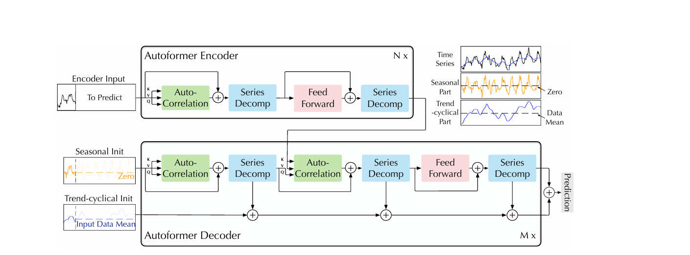
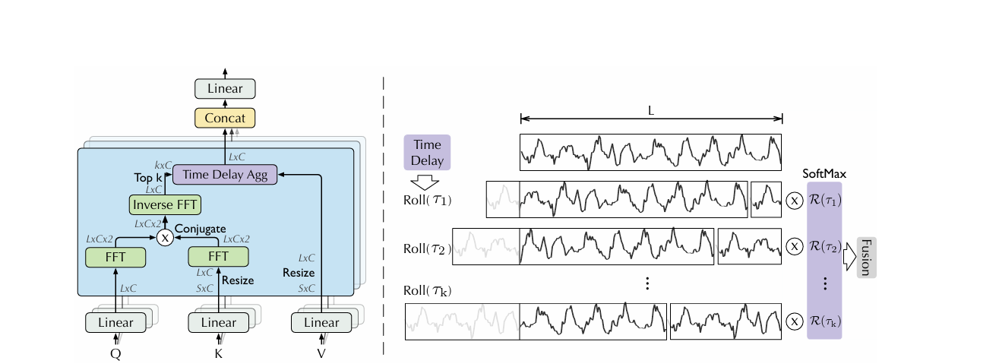

# Transformerによる時系列予測

## 概要
本ドキュメントは、Transformerによる時系列予測に関して、3つの手法で学習してみます。
論文は以下を参考にしています。
Informer: Beyond Efficient Transformer for Long Sequence Time-Series Forecasting

Autoformer: Decomposition Transformers with Auto-Correlation for Long-Term Series Forecasting
---

## 1. データファイル:

---

# 2. Informer: Long-Sequence Time-Series Forecasting

本章では、時系列予測においてTransformerの限界（$O(L^2)$の計算量）を突破し、長期間予測（LSTF）を可能にした画期的なモデル「Informer」の構造とメカニズムについて、数式と具体例を交えて解説する。

### 2.1 エンコーディングに関して

時系列データは、自然言語のように「単語の意味」を持たないため、モデルに「値の大きさ」「配列の順番」「現実世界のカレンダー」という3つの情報を同時に教え込む必要がある。Informerでは、入力系列 $\mathcal{X}^t \in \mathbb{R}^{L_x \times d_x}$ に対して、以下の3つの埋め込み（Embedding）を行い、最終的な入力ベクトル $\mathcal{X}_{feed}$ を生成する。

1. **Value Embedding (値の埋め込み):**
   生の数値データを1次元畳み込み層（Conv1d）に通し、Transformerが扱える次元数 $d_{model}$ に変換する。(xw+bのようにして拡張),αをdmodelの平方根として調整。
2. **Positional Encoding (位置エンコーディング):**
   データが配列のどこにあるかを示す固定の波長ベクトル。
   $$PE_{(pos, 2j)} = \sin(pos / 10000^{2j/d_{model}})$$

   $$PE_{(pos, 2j+1)} = \cos(pos / 10000^{2j/d_{model}})$$
3. **Temporal Encoding (時間特徴エンコーディング):**
   月、日、曜日、時間などのカレンダー情報を、学習可能なカテゴリカル埋め込みとしてベクトル化する。
   $$TE_{(pos)} = \sum_{i \in \{month, day, week, hour\}} \text{Embedding}_i(stamp_i)$$

これらを要素ごとに足し合わせたものがエンコーダへの入力となる。
$$\mathcal{X}_{feed} = αVE + PE + TE$$

**【数値例】**
「6月28日 午前9時」の株価データ `[100, 124, 135]` が入力されたとする（$pos=0,1,2$）。
$pos=0$ の「100」という値は、Value層で512次元のベクトルに変換される。そこに、$pos=0$ に対応する固定の $\sin, \cos$ ベクトルが足され、さらに「6月」「28日」「日曜日」「9時」という4つのカテゴリに対応する学習済みのベクトルが足し合わされ、最終的に512次元ベクトルが完成する。

### 2.2 エンコーダ層に関して

エンコーダの役割は、過去の長い系列から「重要な文脈（Memory）」を抽出することである。Informerはここで**ProbSparse Self-Attention**と**Distilling（蒸留）**という2つの大改造を行っている。

**① ProbSparse Self-Attention（Qの剪定）**
通常のAttentionは、Query($Q$)とKey($K$)のすべての組み合わせの内積を計算するため、計算量が $O(L^2)$ となる。

$$\text{Attention}(Q, K, V) = \text{softmax}\left(\frac{Q K^T}{\sqrt{d_k}}\right) V$$

Informerは、各 $q_i$ がどれだけ「重要（アクティブ）か」を、一様分布とのKL情報量に基づく指標 $\bar{M}(q_i, K)$ で評価する。ここで取り出すのは、一部のデータのみで図る(keyを選定)

$$\bar{M}(q_i, K) = \ln \sum_{j=1}^{L_K} e^{\frac{q_i k_j^T}{\sqrt{d_k}}} - \frac{1}{L_K} \sum_{j=1}^{L_K} \frac{q_i k_j^T}{\sqrt{d_k}}$$

この指標が高い（他のデータに対して強い関心を持つ）上位 $u$ 個のQueryだけを選抜して $\bar{Q}$ とし、計算を行う。(選ばれQueryに全keyを掛ける)。つまり選ばれなかったQの大半は学習はされない。選ばれないところは平均値で埋める。

$$\text{ProbAttention}(Q, K, V) = \text{softmax}\left(\frac{\bar{Q} K^T}{\sqrt{d_k}}\right) V$$

選抜数 $u$ は $u = c \cdot \ln L_Q$ （$c$ は定数）に制限されるため、計算量は $O(L \ln L)$ へと劇的に削減される。

**② Distilling（蒸留操作）**
Attention層の直後に、1次元のMax Pooling層を挟むことで、時間軸方向のデータサイズを半分に圧縮する。FFNした後に。
$$X_{j+1}^t = \text{MaxPool}\left( \text{ELU}\left( \text{Conv1d}( [X_j^t]_{AB} ) \right) \right)$$

**【数値例】**
$L=1000$ のデータを入れた場合、通常のAttentionは $1000 \times 1000 = 1,000,000$ 回の計算が必要になる。しかしProbSparse Attentionでは、たとえば $u = 5 \ln(1000) \approx 34$ 個の優秀なQueryだけが選ばれるため、$34 \times 1000 = 34,000$ 回の計算で済む。さらにDistillingによって、次の層に渡るデータ数は $500 \to 250$ と半減していくため、メモリがパンクしない。

### 2.3 デコーダ層に関して

デコーダは、RNNのような自己回帰（1歩ずつ予測する手法）の「遅さ」と「誤差の蓄積」を防ぐため、**Generative Style Decoder（一発出しデコーダ）**を採用している。

デコーダへの入力 X_deは、既知の直近の過去データ X_token（長さ $L_token）と、予測したい未来の枠を表すゼロ行列 X_0（長さ L_y）を結合したプレースホルダーである。

例えば、過去5日と未来30日の場合、入力時は(35,512)のようになる。ここで、次のステップで使われるのはQ(35,512)で、エンコーダのK,Vと大きさが違うことは注意

デコーダ内部では、まず未来の情報をカンニングしないためのMasked Multi-head Attentionが行われ、その後、エンコーダが抽出した過去の圧縮記憶（$K, V$）と、自身の持つプレースホルダー（$Q$）をぶつけるCross-Attentionが行われる。
最後に全結合層（Linear）を1回だけ通し、最終的な予測値 $Y_{predict}$ を出力する。

**【数値例】**
過去5日分のデータから、未来30日分を予測したいとする。
デコーダには `[過去5日分のデータ] + [0.0が30個並んだ配列]` が入力される。Cross-Attentionによって「このゼロの枠には、エンコーダのどの記憶を当てはめるべきか」が計算され、最後のDNN層を通った瞬間に、30個のゼロが一気に「30日分の具体的な予測数値」へと書き換わって出力される。

### 2.4 特徴（まとめ）

Informerが時系列モデリングの歴史にもたらした主要な特徴は以下の4点に集約される。ここには書いていないが、大前提としてかなり大きなデータセットが必要である。

1. **$O(L \ln L)$ への計算量削減:** ProbSparse AttentionとDistillingの組み合わせにより、長期間の過去データをメモリを枯渇させることなく入力できるようになった。
2. **時間的セマンティクスの完全な統合:** Temporal Encodingにより、現実世界のカレンダー情報（曜日や時間帯による周期性）をディープラーニングの重み空間にマッピングすることに成功した。
3. **誤差蓄積の回避と高速推論:** Generative Style Decoderにより、長期間の未来予測を一回の順伝播（Forward pass）で完結させ、推論速度と安定性を飛躍的に向上させた。
3. **TRANSFORMER(言語モデルとの比較):** Pre-trainingができないので、実装には時間が大幅にかかる 
---

#  Autoformer:

本章では、Informerの半年後に考案された、Autoformer:に関するモデルのアルゴリズムを解説する

概要としては、モデルの計算を減らすことに注力していたが、アプローチを変えてそもそも、トレンドと季節に分けて、推定していけばいいという考えのもの

参考:Autoformer: Decomposition Transformers with Auto-Correlation for Long-Term Series Forecasting

## 3.1 Autoformer エンコーダのアーキテクチャ

Autoformerのエンコーダの主目的は、過去の時系列データ $\mathcal{X}$ に内在する**「真の周期性（季節成分）」を抽出し、ランダムなノイズを極限まで平滑化すること**である。標準的なTransformerのSelf-Attentionメカニズム（計算量 $\mathcal{O}(L^2)$）を廃止し、信号処理に基づく **Auto-Correlation（自己相関）** と **Series Decomposition（時系列分解）** を組み合わせることで、計算量を $\mathcal{O}(L \log L)$ に抑えつつ、時系列特有の文脈を学習する。

参考:Autoformer: Decomposition Transformers with Auto-Correlation for Long-Term Series Forecasting

### 3.1.1 エンコーダ $l$ 層の全体方程式
第 $l$ 層の内部処理は以下の2つの方程式で定式化される。

$$
\mathcal{S}_{en}^{l, 1}, \_ = \text{SeriesDecomp}\left( \text{Auto-Correlation}(\mathcal{X}_{en}^{l-1}, \mathcal{X}_{en}^{l-1}, \mathcal{X}_{en}^{l-1}) + \mathcal{X}_{en}^{l-1} \right)
$$

$$
\mathcal{X}_{en}^{l}, \_ = \text{SeriesDecomp}\left( \text{FeedForward}(\mathcal{S}_{en}^{l, 1}) + \mathcal{S}_{en}^{l, 1} \right)
$$

ここで、$S_en$ は中間表現としての季節成分を表し、抽出されたトレンド成分はエンコーダにおいては不要であるため `_` として破棄される。また、各ブロックの加算（+）は残差接続（Residual Connection）を示している。

---

### 3.1.2 Auto-Correlation（自己相関）メカニズム

このブロックは、波形をシフトさせながら自己類似度を測り、周期性を増幅させる役割を担う。処理は以下の3つのステップに分解される。

#### ① 特徴量テンソルの生成
入力 $\mathcal{X}_{en}^{l-1}$ に対して、学習可能な重み行列 $W_Q, W_K, W_V$ を用いて Query、Key、Value を生成する。これらはすべて同じ入力から派生した同じサイズのテンソルである。ここでのxはCNN等して、512次元になったもので(時間のエンコーディング済み)のもの。

$$
Q = \mathcal{X}_{en}^{l-1} W_Q, \quad K = \mathcal{X}_{en}^{l-1} W_K, \quad V = \mathcal{X}_{en}^{l-1} W_V
$$

#### ② ウィーナー＝ヒンチン定理による周期の発見
時間領域における遅延（ラグ） $\tau$ ごとの自己相関 $\mathcal{R}_{QK}(\tau)$ を、高速フーリエ変換（FFT）を用いて計算する。周波数領域での共役複素数の積（畳み込み定理の応用）により、すべてのズレ幅のスコアを $\mathcal{O}(L \log L)$ で一括計算する。

$$
\mathcal{S}_{QK} = \text{FFT}(Q) \odot \text{FFT}(K)^*
$$
$$
\mathcal{R}_{QK} = \text{iFFT}(\mathcal{S}_{QK})
$$

ここで、$\text{FFT}(\cdot)$ は高速フーリエ変換、* は複素共役、dot は要素ごとのアダマール積、iFFT$ は逆高速フーリエ変換である。得られた $\mathcal{R}_{QK}$ は各ズレ幅 $\tau \in \{1, 2, \dots, L\}$ における周期性の強さ（スコア）の配列となる。

#### ③ Time Delay Aggregation（遅延合成）
計算されたスコア $\mathcal{R}_{QK}$ をもとに、上位 $k$ 個（$k = c \log L$）のラグ $\tau_1, \tau_2, \dots, \tau_k$ を選出する。選ばれたラグの分だけ実体データ $V$ を時間軸に沿ってシフト（Roll）させ、Softmaxで正規化した重みを用いて加重平均をとる。

$$
\hat{\mathcal{R}}_{QK}(\tau_i) = \text{Softmax}(\mathcal{R}_{QK}(\tau_i))
$$
$$
\text{Auto-Correlation}(Q, K, V) = \sum_{i=1}^{k} \hat{\mathcal{R}}_{QK}(\tau_i) \odot \text{Roll}(V, \tau_i)
$$

この操作により、ランダムなノイズが相殺され、真の周期パターンのみが抽出・強化されたテンソル（$\text{new\_V}$）が出力される。

より分かりやすく言うのなら、Qは、現在の波、Vは過去の波のようなもので計算の際に出てくる結果は、どのくらいのずれで親密度がたかいのか、つまり周期性があるのかを取り出している

---

### 3.1.3 Series Decomposition（時系列分解）

Transformerにおける Layer Normalization の代替として機能する、時系列特有の正規化・分解ブロックである。入力テンソル $\mathcal{X}$ を、移動平均（Moving Average）を用いてトレンド成分 $\mathcal{X}_t$ と季節成分 $\mathcal{X}_s$ に分離する。

窓幅 $k$ の平均化プーリング（$\text{AvgPool}$）を用いて、波形の局所的なベースライン（トレンド）を抽出する。

$$
\mathcal{X}_t = \text{AvgPool}(\mathcal{X})
$$

その後、元の波形からトレンド成分を減算することで、ベースラインが $0$ に補正された純粋な季節成分（ギザギザの波形）を得る。

$$
\mathcal{X}_s = \mathcal{X} - \mathcal{X}_t
$$
$$
\text{SeriesDecomp}(\mathcal{X}) = (\mathcal{X}_s, \mathcal{X}_t)
$$

エンコーダにおいては、出力 $(\mathcal{X}_s, \mathcal{X}_t)$ のうち、トレンド成分 $\mathcal{X}_t$ は未来予測に不要なノイズとして破棄され、季節成分 $\mathcal{X}_s$ のみが次へと伝播する。

---

### 3.1.4 Feed-Forward Network (FFN) と最終出力

自己相関と1回目の分解を経た季節成分 $\mathcal{S}_{en}^{l, 1}$ は、位置ごとの特徴表現を深めるために、2層の全結合層と活性化関数からなる Feed-Forward Network に入力される。

$$
\text{FeedForward}(x) = \text{Activation}(x W_1 + b_1) W_2 + b_2
$$

FFNを通過したのち、再び残差接続と SeriesDecomp を経ることで、FFNによる非線形変換で生じた微小なトレンド歪みを完全に除去する。

以上の $l$ 層における一連の処理を $N$ 回繰り返すことで、エンコーダは最終出力 を生成する。このテンソルは、過去の入力時系列から一切のトレンドとノイズが削ぎ落とされた**「純度100%の過去の周期記憶」**として、デコーダの Cross Auto-Correlation 層へと引き継がれる。

## 3.2 Autoformer デコーダのアーキテクチャ

Autoformerのデコーダの目的は、過去のデータから未来の $M$ ステップの波形を予測することである。デコーダの最大の特徴は、**「季節成分（波の上下）」と「トレンド成分（全体の上がり下がり）」の2つのルートを完全に分離して並走させるデュアルパス構造**を持っている点にある。

### 3.2.1 デコーダの初期入力（ゼロ埋めと平均化）

デコーダには、直近の過去データ（助走部分）と、予測したい未来の枠（プレースホルダー）を結合した配列が入力される。このとき、季節ルートとトレンドルートで異なる初期化を行う。

1. **季節成分の初期入力 $\mathcal{X}_{de}^0$:**
   未来の $M$ ステップをすべて `0` で埋める。

2. **トレンド成分の初期入力 $\mathcal{T}_{de}^0$:**
   未来の $M$ ステップを、直近の過去データの平均値（Mean）で平坦に埋める。

### 3.2.2 デコーダ $l$ 層の全体方程式

$l-1$ 層から渡された季節成分  とトレンド成分 、そしてエンコーダから引き継いだ「純度100%の過去の記憶」 を用いて、第 $l$ 層は以下の4つの方程式で定式化される。

$$
\mathcal{S}_{de}^{l, 1}, \mathcal{T}_{de}^{l, 1} = \text{SeriesDecomp}\left( \text{Auto-Correlation}(\mathcal{X}_{de}^{l-1}, \mathcal{X}_{de}^{l-1}, \mathcal{X}_{de}^{l-1}) + \mathcal{X}_{de}^{l-1} \right)
$$

$$
\mathcal{S}_{de}^{l, 2}, \mathcal{T}_{de}^{l, 2} = \text{SeriesDecomp}\left( \text{Cross-Auto-Correlation}(\mathcal{S}_{de}^{l, 1}, \mathcal{X}_{en}^{N}, \mathcal{X}_{en}^{N}) + \mathcal{S}_{de}^{l, 1} \right)
$$

$$
\mathcal{X}_{de}^{l}, \mathcal{T}_{de}^{l, 3} = \text{SeriesDecomp}\left( \text{FeedForward}(\mathcal{S}_{de}^{l, 2}) + \mathcal{S}_{de}^{l, 2} \right)
$$

$$
\mathcal{T}_{de}^{l} = \mathcal{T}_{de}^{l-1} + W_{l, 1} \mathcal{T}_{de}^{l, 1} + W_{l, 2} \mathcal{T}_{de}^{l, 2} + W_{l, 3} \mathcal{T}_{de}^{l, 3}
$$

デコーダ内部の処理は、大きく分けて「未来の仮組み」「エンコーダ記憶の流し込み」「トレンドの累積」という役割を持つ。

---

### 3.2.3 ステップ1: Self Auto-Correlation（未来の仮組み）

デコーダ自身の入力 $\mathcal{X}_{de}^{l-1}$ を用いて、自己相関（$Q, K, V$ すべてがデコーダ由来）を行う。

入力の後半（未来部分）は `0` でパディングされているため、FFTによる相関スコア計算において、未来部分は数学的に無視（`+0`として扱われる）される。結果として、直近の過去（助走部分）の波形のみから周期性が算出され、その周期に基づいて配列がシフト（Roll）される。
これにより、`0` で埋まっていた未来の空箱に過去の波形が外挿され、大雑把な「未来の仮組み波形」が生成される。

直後の $\text{SeriesDecomp}$ により、この仮組み処理の過程で生じたトレンドの歪みが $\mathcal{T}_{de}^{l, 1}$ として抽出・保管される。

---

### 3.2.4 ステップ2: Cross Auto-Correlation（過去の記憶の流し込み）

ここで、季節ルートにエンコーダの出力 $\mathcal{X}_{en}^{N}$ が合流する。

* **$Q$ (Query):** デコーダで生成した「未来の仮組み波形」（検索の手がかり）
* **$K$ (Key):** エンコーダの「完璧な過去の記憶」（照合用のデータベース）
* **$V$ (Value):** エンコーダの「完璧な過去の記憶」（流し込む実体データ）

デコーダの仮組み波形（$Q$）を基準とし、エンコーダの膨大な過去データ（$K$）との間でFFTによる親密度計算を行う。最も相関の高い（周期が一致する）過去のラグ $\tau$ を特定し、そのラグに基づいてエンコーダの精緻な波形（$V$）をシフトさせる。

この操作により、デコーダの粗い予測波形の上に、ノイズが除去された高解像度な過去の波形パターンが直接マッピング（流し込み）される。その後、再び $\text{SeriesDecomp}$ を経て、純化された季節成分 と、トレンドの副産物に分離される。

---

### 3.2.5 ステップ3: トレンドの累積と最終出力

季節ルートが $\text{FeedForward}$ を経て最終的な未来の季節予測 $\mathcal{X}_{de}^{l}$ を完成させる裏で、トレンドルートは「累積（ちりつも加算）」を行っている。

エンコーダとは異なり、デコーダ内で抽出された3つのトレンド成分は破棄されない。それぞれに線形変換（重み W）を適用し、前層から引き継いだベースのトレンド  に対して順次加算していく。

$$
\mathcal{T}_{de}^{l} = \mathcal{T}_{de}^{l-1} + W_{l, 1} \mathcal{T}_{de}^{l, 1} + W_{l, 2} \mathcal{T}_{de}^{l, 2} + W_{l, 3} \mathcal{T}_{de}^{l, 3}
$$

これにより、初期状態では「平均値の平坦な線」であったトレンド入力が、層を重ねるごとに微細な傾きや変化を獲得し、正確な未来のトレンドカーブへと成長する。

### 3.3 最終予測の出力（合流）
全 $N$ 層のデコーダ処理が完了したのち、モデルの最終出力 $\mathcal{Y}_{predict}$ は、完成した季節成分とトレンド成分の単純な和として算出される。

$$
\mathcal{Y}_{predict} = \mathcal{W}_{S} \mathcal{X}_{de}^{N} + \mathcal{T}_{de}^{N}
$$

（※ $\mathcal{W}_{S}$ は季節成分のスケールを最終調整する投影行列）

波の性質（周期）に特化した自己相関による「季節ルート」と、全体の傾きに特化した移動平均の累積による「トレンドルート」。この2つを独立して計算し、最後に統合するアーキテクチャこそが、Autoformerの予測精度の根幹を成している。

## 3.4 Autoformerの特徴と結論（Conclusion）

Autoformerは、自然言語処理向けに作られたTransformerの構造をそのまま時系列データに流用するのではなく、**「時系列データが本来持つ数学的性質（トレンドと周期性）」に真っ向から向き合い、アーキテクチャを根本から再設計したモデル**である。

本論文が提示した主要なブレイクスルーと特徴は、以下の3点に集約される。

### 3.3.1. 複雑な時系列を解き明かす「深層時系列分解（Deep Series Decomposition）」
従来のモデルが時系列データを「単なる数字の羅列」として扱っていたのに対し、Autoformerは内部に移動平均ブロック（`SeriesDecomp`）を組み込み、**トレンド成分と季節成分を分離して処理するデュアルパス構造**を実現した。
これにより、デコーダの最終出力において「全体の傾向（トレンド）」と「周期的な変動（季節）」がそれぞれ独立した根拠として出力される。これは予測精度の向上だけでなく、**「AIがなぜその予測をしたのか」という解釈可能性（Interpretability）を飛躍的に高める**という、実運用において極めて重要な利点をもたらしている。

### 3.3.2. 「点」から「波」へのパラダイムシフト（Auto-Correlation）
標準的なSelf-Attentionメカニズムは、系列内の「点（各タイムステップ）」同士の関連度を総当たりで計算するため、ノイズに弱く、情報の集約に限界があった。
Autoformerはこれを廃止し、ウィーナー＝ヒンチン定理とFFT（高速フーリエ変換）に基づく **Auto-Correlation（自己相関）** を導入した。これにより、点同士ではなく**「波（サブシリーズ）全体」のレベルでパターンの親密度を測り、真の周期性をあぶり出して合成する**という、信号処理的に極めて理にかなった情報抽出を可能にした。

### 3.3.3 計算量 $\mathcal{O}(L \log L)$ による長期予測（LSTF）の実現
FFTの分割統治法を利用することで、Attentionが抱えていた計算量とメモリ使用量の爆発（$\mathcal{O}(L^2)$）を $\mathcal{O}(L \log L)$ へと劇的に削減した。
さらに、自己相関による強力なノイズ除去と、トレンドのちりつも累積によって誤差の増幅を防いだ結果、従来モデル（InformerやLogSparse Transformerなど）と比較して、**Long-term Time Series Forecasting（長期時系列予測）のタスクにおいて最先端（State-of-the-Art）の精度を達成**した。

結論として、Autoformerは深層学習に古典的な信号処理の知見を美しく融合させることで、長期間の複雑な時系列データに対しても、高速かつ高精度、そして解釈可能な予測を行うための新しいスタンダードを確立したと言える。

また、基本的にInformerよりもAutoformerのほうが圧倒的に精度が良く、完全に「中長期的（Long-term）」な予測に特化したモデルになっている。

---

# 4. A TIME SERIES IS WORTH 64 WORDS:　LONG-TERM FORECASTING WITH TRANSFORMERS

本章では、よりモデルを簡単に、そして構造をわかりやすくし、計算量も圧倒的に減らしたモデル PatchTSTに関して説明する。

## 4.1 PatchTSTの良さ（革新性と強み）

PatchTSTが、InformerやAutoformerといった過去のSOTAモデルを打ち破り、時系列予測の覇権を握った理由は、その「圧倒的なシンプルさ」と「物理的な計算量の圧縮」にある。本手法の革新性と強みは、以下の4点に集約される。

### 4.1.1 局所的な意味（Local Semantic）の獲得
従来のモデルは時系列の「1時点」を1つの入力単位（トークン）としていたが、これでは単なるノイズと真の変化の区別が難しい。PatchTSTは複数ステップをまとめた「パッチ」を1トークンとすることで、自然言語における「単語」のように、波の局所的なトレンドや周期性といった「意味のある文脈」をTransformerに直接学習させることができる。

### 4.1.2. 計算量とメモリの劇的な削減
過去の系列長 $L$ をパッチ長 $P$ で分割することで、Transformerに入力されるトークン数 $N$ は約 $L/P$ に激減する。Attentionメカニズムの計算量はトークン数の2乗に比例するため、計算量は $\mathcal{O}(L^2)$ から $\mathcal{O}((L/P)^2)$ へと物理的に圧縮される。これにより、Informer（確率論）やAutoformer（FFT）のような複雑な回避策を用いずとも、過去の超長期データを直接Transformerに入力することが可能になった。

### 4.1.3. チャネル独立性（Channel-Independence）によるロバスト性の向上
多変量データを1つのベクトルに混ぜて入力する従来手法（Channel-Dependent）は、一見すると変数間の相関を学習できそうに見えるが、実際にはチャネル間のノイズ干渉を引き起こし、予測精度を低下させる原因となっていた。すべての変数を独立した単変量として処理することで、純粋な時間的なダイナミクスのみに集中でき、学習の安定性と精度が飛躍的に向上した。

### 4.1.4 デコーダ不要の圧倒的シンプルさ
時系列分解（Decomp）層や、未来をゼロ埋めしてCross Attentionを行う複雑なデコーダ構造を完全に廃止した。純粋な「バニラTransformerエンコーダ」のみで構成されているため、実装が極めて容易でありながら、モデルの表現力を最大限に引き出すことに成功している。

---

## 4.2 PatchTSTの内部アーキテクチャと完全な数式モデル

PatchTSTの内部処理は、テンソルの「形状（次元）」の巧みな操作によって構築されている。入力から最終的な未来予測が出力されるまでの完全な数式モデルを以下に定式化する。

### ① 入力とチャネルの独立化（Channel-Independence）
過去のルックバックウィンドウ長を $L$、予測したい未来の長さを $T$、多変量時系列のチャネル数を $M$ とする。
初期入力テンソル $\mathcal{X}_{in} \in \mathbb{R}^{M \times L}$ を、$M$ 個の独立した単変量時系列ベクトル $x^{(i)}$ に分割する。

$$
x^{(i)} \in \mathbb{R}^{1 \times L} \quad (i = 1, 2, \dots, M)
$$

以降の計算は、すべてのチャネル $i$ に対して全く同じ重みパラメータを共有しながら並列に行われる。

### ② パッチ化（Patching）
長さ $L$ の単変量時系列 $x^{(i)}$ を、パッチ長 $P$、ストライド $S$ で分割し、2次元のパッチ群テンソル $x_p^{(i)}$ へと変換（Unfold）する。

$$
x_p^{(i)} \in \mathbb{R}^{N \times P}
$$

ここで、生成されるパッチ（トークン）の総数 $N$ は以下の式で定まる。

$$
N = \left\lfloor \frac{L - P}{S} \right\rfloor + 1
$$

### ③ 埋め込みと位置エンコーディング（Projection & Position Embedding）
各パッチ（次元 $P$）を、Transformerの隠れ層の次元 $D$ へと線形射影（Linear Projection）する。このとき、学習可能な重み行列 $W \in \mathbb{R}^{P \times D}$ とバイアス $b \in \mathbb{R}^{D}$ を用いる。

$$
X_d^{(i)} = x_p^{(i)} W + b \quad \in \mathbb{R}^{N \times D}
$$

さらに、各パッチの時系列的な順序をモデルに認識させるため、学習可能な位置エンコーディング行列 $W_{pos} \in \mathbb{R}^{N \times D}$ を加算し、エンコーダへの最終入力 $\mathcal{Z}_0^{(i)}$ を作成する。

$$
\mathcal{Z}_0^{(i)} = X_d^{(i)} + W_{pos} \quad \in \mathbb{R}^{N \times D}
$$

### ④ Transformerエンコーダ（Multi-Head Attention）
$\mathcal{Z}_0^{(i)}$ を、標準的なTransformerエンコーダ（$l = 1, \dots, K$ 層）に入力する。各層ではパッチ同士の親密度を測る Multi-Head Attention と Feed-Forward Network が適用される。
エンコーダの層における Attention 計算は以下のように定式化される。

$$
Q = \mathcal{Z}_{l-1}^{(i)} W_Q, \quad K = \mathcal{Z}_{l-1}^{(i)} W_K, \quad V = \mathcal{Z}_{l-1}^{(i)} W_V
$$

$$
\text{Attention}(Q, K, V) = \text{Softmax}\left(\frac{Q K^T}{\sqrt{D_k}}\right) V
$$

すべての層を通過したのち、入力時と同じ形状のテンソル $\mathcal{Z}_{out}^{(i)}$ が出力される。

$$
\mathcal{Z}_{out}^{(i)} \in \mathbb{R}^{N \times D}
$$

### ⑤ 平坦化と線形予測ヘッド（Flatten + Linear Head）
エンコーダから出力されたテンソルを1次元ベクトルに平坦化（Flatten）する。

$$
Z_{flat}^{(i)} = \text{Flatten}(\mathcal{Z}_{out}^{(i)}) \quad \in \mathbb{R}^{1 \times (N \cdot D)}
$$

この平坦化されたベクトルを、一回の線形変換（Linear Head）によって直接未来の $T$ ステップの予測値へと射影する。重み行列 $W_{head} \in \mathbb{R}^{(N \cdot D) \times T}$ とバイアス $b_{head} \in \mathbb{R}^{T}$ を用いる。

$$
\hat{x}^{(i)} = Z_{flat}^{(i)} W_{head} + b_{head} \quad \in \mathbb{R}^{1 \times T}
$$

### ⑥ 出力の統合（Concatenation）
最後に、独立して予測された $M$ 個の単変量未来予測ベクトル $\hat{x}^{(i)}$ をチャネル方向に結合（Concatenate）し、最終的な多変量予測テンソル $\hat{\mathcal{X}}_{predict}$ を得る。

$$
\hat{\mathcal{X}}_{predict} = \text{Concat}(\hat{x}^{(1)}, \hat{x}^{(2)}, \dots, \hat{x}^{(M)}) \quad \in \mathbb{R}^{M \times T}
$$

参考
Informer: Beyond Efficient Transformer for Long Sequence Time-Series Forecasting,Haoyi Zhou, Shanghang Zhang, Jieqi Peng, Shuai Zhang, Jianxin Li, Hui Xiong, Wancai Zhang

Autoformer: Decomposition Transformers with Auto-Correlation for Long-Term Series Forecasting,Haixu Wu, Jiehui Xu, Jianmin Wang, Mingsheng Long